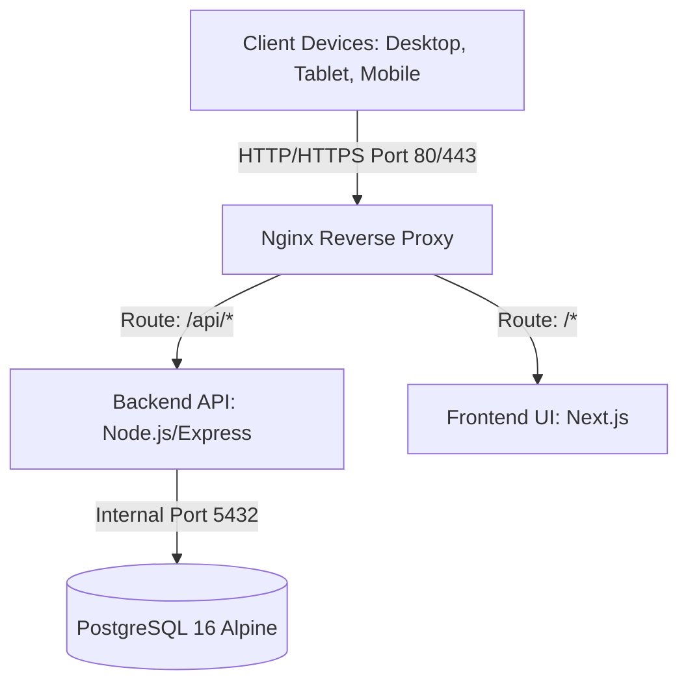

# 🤖 PrintCost - Agent Instructions & Coding Standards

This document serves as the **source of truth** for all development, refactoring, and AI-assisted agent tasks in the `PrintCost` repository. All generated code, database migrations, API endpoints, and user interface components must strictly adhere to the guidelines and specifications documented below.

---

## 1. Project Overview & Architecture

### System Architecture
PrintCost is a **Self-hosted 3D Printing Cost Management System** built with a monolithic 3-tier architecture, designed to run locally on a Mac Mini M4 using Docker Compose.



### Infrastructure Configuration
- **Resource Constraints (Limits)**:
  - **nginx**: Alpine-based, 0.5 CPU, 256MB RAM. Exposed on host ports `80`/`443`.
  - **frontend**: Next.js, 2.0 CPU, 2GB RAM. Internal port `3000`.
  - **backend**: Node.js/Express API, 4.0 CPU, 4GB RAM. Internal port `8080`.
  - **db**: PostgreSQL 16 Alpine, 2.0 CPU, 2GB RAM. Internal port `5432` (Internal only, not exposed on host network).
- **Docker Networks**: Secure internal network. Only Nginx is accessible from the host/external network.
- **File Uploads**: Do not store image files as Base64 or Binary Large Objects (BLOB) in the database. Images must be saved as physical files in a mapped volume (`./uploads` mapping to Nginx `/uploads`) and reference their file paths/URLs in the database tables.

---

## 2. Database Schema Specification (Schema V4 - Ironclad Edition)

All schema configurations, migration scripts, or raw SQL transactions must follow the strict constraints configured in `scripts/init.sql`.

### Core Database Rules
1. **No Floating Points for Financials**: Never use `FLOAT` or `REAL` types for currency or pricing calculations. Always use `NUMERIC(12, 2)` or `NUMERIC(12, 4)` to preserve decimal accuracy.
2. **Defensive Database-Level Integrity Checks**: Rely on PostgreSQL features like `CHECK` constraints, domains, views, and database triggers. Do not rely solely on application-level validations.
3. **Rounding Semantics**:
   - System function: `round_to_100(raw_value)`.
   - Behavior: Performs "Round Half-Up" to the nearest 100 VND (e.g. 24,931 VND -> 24,900 VND; 24,950 VND -> 25,000 VND).
   - Validation: Throws a database exception if `raw_value < 0` or if `final_unit_price` does not equal `round_to_100(final_unit_price)`.
4. **Calculated Columns (No Drift)**:
   - `order_items.raw_unit_cogs` is `GENERATED ALWAYS AS (raw_material_cost + raw_machine_cost + raw_labor_cost + raw_fixed_items_cost) STORED`.
   - `order_items.total_item_price` is `GENERATED ALWAYS AS (final_unit_price * quantity) STORED`.
5. **Snapshot Isolation (Order Item Freeze)**:
   - When adding an item to an order, the system must "freeze" the state of that product (name, material details, weight, print time, default margins, etc.) by writing all calculations and config properties directly into fields prefixed with `snapshot_` in `order_items`. This ensures historical accuracy if products are edited or deleted later.

### Table Schema Summary
- **materials**: Plastic filament settings (name, price_per_kg, default_margin, fail_rate).
- **operational_configs**: Fixed settings values for `machine_depreciation_per_hour` and `labor_cost_per_minute`.
- **fixed_items**: Material/Packaging catalog (packaging or accessory).
- **products**: Product configuration template (weights, durations, and dependencies).
- **product_fixed_items**: Join table for accessory/packaging list with quantities.
- **orders**: Customer purchase tracking (name, status, loss indicator).
- **order_items**: Ledger lines capturing the historical costs and pricing snapshots.

---

## 3. Order Status & State Machine Locking

### State Transitions
Orders progress through the following lifecycle:
`draft` ➔ `printing` ➔ `completed` ➔ `shipping` ➔ `delivered` (or `cancelled`)

### The Ironclad Lock Mechanism
- **Lock Activation**: Triggered automatically when an order reaches `status = 'cancelled'` AND `is_loss_counted = TRUE` (used for reporting loss of wasted filament/resources).
- **Database Locks**:
  - `orders`: Any `UPDATE` or `DELETE` attempt on a locked record throws an exception.
  - `order_items`: Any `INSERT`, `UPDATE`, or `DELETE` attempt targeting elements associated with the locked `order_id` throws an exception.
- **Application Rule**: When building API handlers, prevent user mutations on frontend and backend if the order matches the locked conditions. Gracefully report lock status.

---

## 4. Calculation Engine Formulas

The calculation logic must be identical between database representation, backend endpoints, and frontend real-time calculators:

### 1. Raw Material Cost (Filament + Fail Rate)
$$\text{Raw Material Cost} = \text{Weight (grams)} \times \left( \frac{\text{Price per kg}}{1000} \right) \times \text{Fail Rate}$$

### 2. Raw Machine Cost (Power + Depreciation)
$$\text{Raw Machine Cost} = \left( \frac{\text{Print Time in Seconds}}{3600} \right) \times \text{Depreciation per Hour}$$

### 3. Raw Labor Cost
$$\text{Raw Labor Cost} = \text{Labor Time in Minutes} \times \text{Labor Cost per Minute}$$

### 4. Raw Unit COGS (Cost of Goods Sold)
$$\text{Raw Unit COGS} = \text{Raw Material Cost} + \text{Raw Machine Cost} + \text{Raw Labor Cost} + \sum(\text{Fixed Item Unit Cost} \times \text{Quantity})$$

### 5. Raw Suggested Price
$$\text{Raw Suggested Price} = \frac{\text{Raw Unit COGS}}{1 - \text{Margin}}$$

### 6. Final Suggested Price (Rounded)
$$\text{Final Suggested Price} = \text{round\_to\_100}(\text{Raw Suggested Price})$$

*Note: Application code must never run intermediate rounding on raw cost components. Only the final suggested price or custom unit price (`final_unit_price`) is subject to rounding rules.*

---

## 5. Express Backend Coding Standards

All backend contributions must adhere to the following implementation standards.

### 5.1. Financial Precision with `big.js`
* **ABSOLUTELY DO NOT** use standard arithmetic operators (`+`, `-`, `*`, `/`) or native float types (`number` in JS) for intermediate calculations of currency, costs, or profit margins.
* All intermediate calculations must use the `big.js` library.
* Only convert the `Big` data type back to a standard JS `number` at the final output (JSON Response) or when storing to the database (preserving the precision of `NUMERIC` fields in Postgres).
* Configure the rounding mode to `ROUND_HALF_UP` (mode `1` in Big.js) globally:

```typescript
import Big from 'big.js';
Big.RM = 1; // Round mode = 1 (ROUND_HALF_UP)
```

#### Financial Rounding Function
The final unit price must be rounded to the nearest **100 VND**:

```typescript
export function roundTo100(rawValue: Big): number {
  if (rawValue.lt(0)) {
    throw new Error('LỖI HỆ THỐNG: Giá trị tài chính không được phép âm');
  }
  const divided = rawValue.div(100);
  const rounded = divided.round(0); // Uses Big.RM = 1
  return rounded.times(100).toNumber();
}
```

---

### 5.2. Database & Knex.js Transactions
When writing data to multiple parent-child tables (e.g., creating a new order and storing its associated order items), it is **mandatory** to wrap them in a Database Transaction using Knex.

```typescript
import { db } from '../database/client';

export async function createOrderWithItems(orderData: any, items: any[]) {
  return await db.transaction(async (trx) => {
    // 1. Insert parent order
    const [insertedOrder] = await trx('orders')
      .insert({
        customer_name: orderData.customer_name,
        customer_contact: orderData.customer_contact,
        status: 'draft',
      })
      .returning('*');

    // 2. Prepare items with calculated cost snapshots
    const itemsToInsert = items.map(item => {
      return {
        order_id: insertedOrder.id,
        product_id: item.product_id,
        snapshot_product_name: item.name,
        // ... other snapshot fields
        final_unit_price: item.final_unit_price,
        quantity: item.quantity,
      };
    });

    // 3. Insert child items
    await trx('order_items').insert(itemsToInsert);
    return insertedOrder;
  });
}
```

#### Database Error Handling Middleware
Capture specific PostgreSQL constraint/trigger violations and return standard JSON responses:

```typescript
import { Request, Response, NextFunction } from 'express';
import { ZodError } from 'zod';

export function errorHandler(err: any, req: Request, res: Response, next: NextFunction) {
  // 1. Trap Zod Validation Errors
  if (err instanceof ZodError) {
    return res.status(400).json({
      success: false,
      message: 'Dữ liệu nhập vào không hợp lệ hoặc sai định dạng toán học',
      errors: err.errors.map(e => ({ field: e.path.join('.'), message: e.message }))
    });
  }

  // 2. Trap PostgreSQL Database Violations (Knex Exceptions)
  if (err.code) {
    switch (err.code) {
      case '23505': // Unique key violation
        return res.status(409).json({ 
          success: false, 
          message: 'Dữ liệu này đã tồn tại (Bị trùng tên danh mục).' 
        });
      case '23514': // CHECK constraint violation
        return res.status(400).json({ 
          success: false, 
          message: 'Yêu cầu bị từ chối: Vi phạm giới hạn miền giá trị toán học (Số lượng/Giá trị phải lớn hơn 0).' 
        });
      case '23503': // Foreign key violation
        return res.status(400).json({ 
          success: false, 
          message: 'Không thể thực hiện thao tác do dữ liệu đang được liên kết trong các Sản phẩm hoặc Đơn hàng khác.' 
        });
      case 'P0001': // Custom trigger exception (e.g. Ironclad Lock trigger)
        return res.status(409).json({ 
          success: false, 
          message: `Vi phạm luật vận hành xưởng: ${err.message.replace(/^error:\s*/i, '')}` 
        });
    }
  }

  // 3. Fallback for general server exceptions
  console.error('🔴 [BACKEND CRITICAL EXCEPTION]:', err);
  return res.status(500).json({
    success: false,
    message: err.message || 'Hệ thống gặp sự cố bất ngờ. Vui lòng kiểm tra log Docker của Mac Mini M4.'
  });
}
```

---

### 5.3. Avoiding Zod Validation Pitfalls (The Coercion Trap)
In Express, inputs are often parsed as strings. Standard `z.coerce.number()` turns `""` or `null` into `0`, bypassing validation. Use a pre-processing helper instead:

```typescript
import { z } from 'zod';

// Preprocess empty inputs to null instead of converting them to 0
export const safeCoerceNumber = z.preprocess((val) => {
  if (val === null || val === undefined) return null;
  if (typeof val === 'string' && val.trim() === '') return null;
  return Number(val);
}, z.number().nullable());

// Example validation schema
export const createMaterialSchema = z.object({
  name: z.string().trim().min(1, 'Tên loại nhựa không được để trống'),
  price_per_kg: safeCoerceNumber.pipe(
    z.number().positive('Giá nhựa phải lớn hơn 0')
  ),
});
```

---

### 5.4. Integration Testing with Vitest
When writing automated integration tests, ensure clean, isolated DB states:

```typescript
import { db } from '../../core/database/client';
import { beforeAll, beforeEach, afterAll } from 'vitest';

beforeAll(async () => {
  await db.raw('SELECT 1'); // verify connection
});

beforeEach(async () => {
  // Truncate tables and restart IDs
  await db.raw('TRUNCATE TABLE order_items, orders, product_fixed_items, products, fixed_items, materials RESTART IDENTITY CASCADE');
  
  // Seed operational configs
  await db('operational_configs').insert([
    { key: 'machine_depreciation_per_hour', value: 5000.0000 },
    { key: 'labor_cost_per_minute', value: 500.0000 }
  ]).onConflict('key').merge();
});

afterAll(async () => {
  await db.destroy();
});
```

---

## 6. Frontend UI & Styling Guidelines

- **Tech Stack**: Next.js (App Router), React, TypeScript, Vanilla CSS.
- **Aesthetics & UI/UX**:
  - Premium, modern, and dark-themed visual language.
  - Smooth micro-animations and transition states.
  - Curated, consistent color palettes (avoid default basic hex codes).
  - Responsive layouts (ergonomically designed for mobile, tablet, and desktop).
- **Real-Time Calculations**:
  - Implement instant calculations in forms without requiring a submit button.
  - The UI must calculate suggested prices using the identical formula engine in section 4.
  - Implement a clean time input (Hours:Minutes:Seconds) converting seamlessly to seconds in API payloads.

---

## 7. Directory Structure & Key Files

- `docs/`: Technical specifications.
  - `README.md`: Setup, architecture, and guides.
  - `db_schema_v4.md`: Detailed database logic.
  - `functional_requirements.md`: Screen-by-screen specifications.
- `scripts/`: Utilities for operations.
  - `init.sql`: Main database setup schema.
  - `test-db.sh`: Verification suite verifying the schema rules.
  - `backup.sh` & `setup-launchd.sh`: Backup automation schedules.
- `backend/`: API services.
- `frontend/`: Web user interface.
- `.agent/`: Agent instructions & configurations.
  - `instruction.md`: Consolidated instructions and guidelines (this file).
  - `SKILL/`: Folder containing community/third-party agent skills.
    - `diegosouzapw-postgres-best-practices-v3/`
    - `majiayu000-api-design-absolutelyskilled-absolutelyskilled/`
    - `majiayu000-api-rest-design/`
    - `partme-ai-vitest/`

---

## 8. Operational Runbook

All agents and developers should know the core commands:
- **Up all containers**: `docker-compose up -d`
- **Tear down stack**: `docker-compose down`
- **Run DB verification**: `bash scripts/test-db.sh`
- **Inspect DB logs**: `docker-compose logs -f db`
- **Database console**: `docker exec -it printcost_db psql -U admin -d printcost_db`
- **Run backend tests**: `npm run test` (inside `backend/` directory)

---

## 9. Agent Behavioral Safeguards

When writing or modifying files:
1. **Strictly Preserve Database Triggers**: Do not try to bypass database constraint locks or rewrite PostgreSQL trigger logic inside application handlers. The database is the ultimate authority.
2. **Never Zero-out Margins**: Be careful with defaults. Default margins must reside between 0.00 and 1.00.
3. **No Placeholders**: Never write dummy functions like `// TODO: calculate this later`. Implement all features completely.
4. **Use Types**: Maintain full type safety across APIs and UI components. Match types directly with the database fields.

---

## 10. Usage Guidelines for Agent Skills (SKILL)

When performing development tasks in this repository, agents must refer to and apply the appropriate external skills stored in `.agent/SKILL/` based on the task type:

1. **`diegosouzapw-postgres-best-practices-v3`**:
   - **When to use**: When designing, modifying, or querying PostgreSQL database schemas, writing migration/initialization scripts, optimizing queries (e.g., indexes, joins), or managing transactions.
   - **Key focus**: Strict adherence to naming conventions, performance optimization, and data-integrity constraints.

2. **`majiayu000-api-design-absolutelyskilled-absolutelyskilled` & `majiayu000-api-rest-design`**:
   - **When to use**: When defining new API routes, request/response payload schemas (Zod), status code standards, error payload structures, and overall RESTful API architecture.
   - **Key focus**: Clear endpoint resources, consistent URL routing, standard HTTP verbs, and robust REST standards.

3. **`partme-ai-vitest`**:
   - **When to use**: When writing or updating unit and integration test suites, mock requests/responses, database transaction rollbacks in tests, and test hook workflows (`beforeAll`, `beforeEach`, `afterAll`).
   - **Key focus**: Effective assertion testing, isolation of database test states, and clean process termination.

