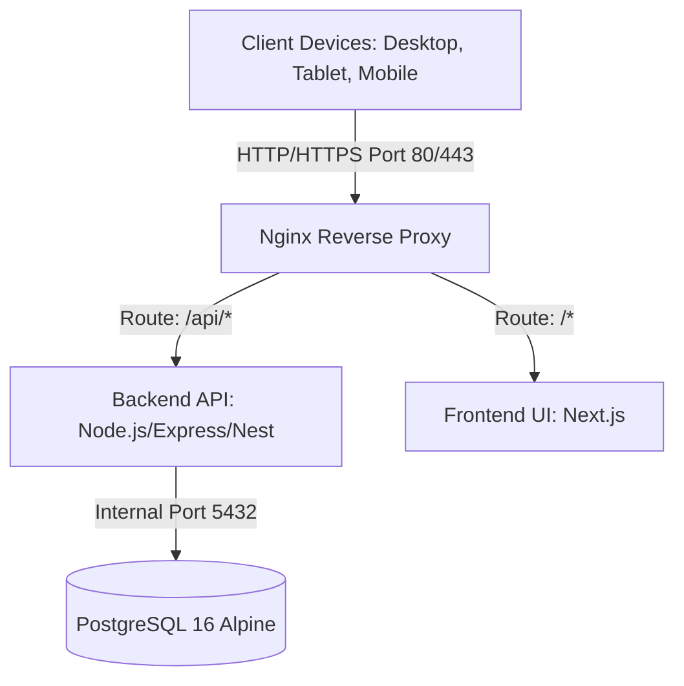

# 🤖 PrintCost - Agent Instructions & Coding Standards

This document serves as the **source of truth** for all development, refactoring, and AI-assisted agent tasks in the `PrintCost` repository. All generated code, database migrations, API endpoints, and user interface components must strictly adhere to the guidelines and specs documented below.

---

## 1. Project Overview & Architecture

### System Architecture
PrintCost is a **Self-hosted 3D Printing Cost Management System** built with a monolithic 3-tier architecture, designed to run locally on a Mac Mini M4 using Docker Compose.

### Infrastructure Configuration
- **Resource Constraints (Limits)**:
  - **nginx**: Alpine-based, 0.5 CPU, 256MB RAM. Exposed on host ports `80`/`443`.
  - **frontend**: Next.js, 2.0 CPU, 2GB RAM. Internal port `3000`.
  - **backend**: Node.js API, 4.0 CPU, 4GB RAM. Internal port `8080`.
  - **db**: PostgreSQL 16 Alpine, 2.0 CPU, 2GB RAM. Internal port `5432` (Internal only, not exposed on host network).
- **Docker Networks**: Secure internal network. Only Nginx is accessible from the host/external network.
- **File Uploads**: Do not store image files as Base64 or Binary Large Objects (BLOB) in the database. Images must be saved as physical files in a mapped volume (`./uploads` mapping to Nginx `/uploads`) and reference their file paths/URLs in the database tables.

---

## 2. Database Schema Specification (Schema V4 - Ironclad Edition)

All schema configurations, migration scripts, or raw SQL transactions must follow the strict constraints configured in `scripts/init.sql`.

### Core Database Rules
1. **No Floating Points for Financials**: Never use `FLOAT` or `REAL` types for currency or pricing calculations. Always use `NUMERIC(12, 2)` or `NUMERIC(12, 4)` to preserve decimal accuracy.
2. **Defensive Database-Level Integrity Checks**: Rely on PostgreSQL features like `CHECK` constraints, domains, views, and database triggers. Do not rely solely on application-level validations.
3. **Rounding Semantics**:
   - System function: `round_to_100(raw_value)`.
   - Behavior: Performs "Round Half-Up" to the nearest 100 VND (e.g. 24,931 VND -> 24,900 VND; 24,950 VND -> 25,000 VND).
   - Validation: Throws a database exception if `raw_value < 0` or if `final_unit_price` does not equal `round_to_100(final_unit_price)`.
4. **Calculated Columns (No Drift)**:
   - `order_items.raw_unit_cogs` is `GENERATED ALWAYS AS (raw_material_cost + raw_machine_cost + raw_labor_cost + raw_fixed_items_cost) STORED`.
   - `order_items.total_item_price` is `GENERATED ALWAYS AS (final_unit_price * quantity) STORED`.
5. **Snapshot Isolation (Order Item Freeze)**:
   - When adding an item to an order, the system must "freeze" the state of that product (name, material details, weight, print time, default margins, etc.) by writing all calculations and config properties directly into fields prefixed with `snapshot_` in `order_items`. This ensures historical accuracy if products are edited or deleted later.

### Table Schema Summary
- **materials**: Plastic filament settings (name, price_per_kg, default_margin, fail_rate).
- **operational_configs**: Fixed settings values for `machine_depreciation_per_hour` and `labor_cost_per_minute`.
- **fixed_items**: Material/Packaging catalog (packaging or accessory).
- **products**: Product configuration template (weights, durations, and dependencies).
- **product_fixed_items**: Join table for accessory/packaging list with quantities.
- **orders**: Customer purchase tracking (name, status, loss indicator).
- **order_items**: Ledger lines capturing the historical costs and pricing snapshots.

---

## 3. Order Status & State Machine Locking

### State Transitions
Orders progress through the following lifecycle:
`draft` ➔ `printing` ➔ `completed` ➔ `shipping` ➔ `delivered` (or `cancelled`)

### The Ironclad Lock Mechanism
- **Lock Activation**: Triggered automatically when an order reaches `status = 'cancelled'` AND `is_loss_counted = TRUE` (used for reporting loss of wasted filament/resources).
- **Database Locks**:
  - `orders`: Any `UPDATE` or `DELETE` attempt on a locked record throws an exception.
  - `order_items`: Any `INSERT`, `UPDATE`, or `DELETE` attempt targeting elements associated with the locked `order_id` throws an exception.
- **Application Rule**: When building API handlers, prevent user mutations on frontend and backend if the order matches the locked conditions. Gracefully report lock status.

---

## 4. Calculation Engine Formulas

The calculation logic must be identical between database representation, backend endpoints, and frontend real-time calculators:

### 1. Raw Material Cost (Filament + Fail Rate)
$$\text{Raw Material Cost} = \text{Weight (grams)} \times \left( \frac{\text{Price per kg}}{1000} \right) \times \text{Fail Rate}$$

### 2. Raw Machine Cost (Power + Depreciation)
$$\text{Raw Machine Cost} = \left( \frac{\text{Print Time in Seconds}}{3600} \right) \times \text{Depreciation per Hour}$$

### 3. Raw Labor Cost
$$\text{Raw Labor Cost} = \text{Labor Time in Minutes} \times \text{Labor Cost per Minute}$$

### 4. Raw Unit COGS (Cost of Goods Sold)
$$\text{Raw Unit COGS} = \text{Raw Material Cost} + \text{Raw Machine Cost} + \text{Raw Labor Cost} + \sum(\text{Fixed Item Unit Cost} \times \text{Quantity})$$

### 5. Raw Suggested Price
$$\text{Raw Suggested Price} = \frac{\text{Raw Unit COGS}}{1 - \text{Margin}}$$

### 6. Final Suggested Price (Rounded)
$$\text{Final Suggested Price} = \text{round\_to\_100}(\text{Raw Suggested Price})$$

*Note: Application codes must never run intermediate rounding on raw cost components. Only the final suggested price or custom chốt bán (`final_unit_price`) is subject to rounding rules.*

---

## 5. Development Guidelines

### Backend (Node.js API)
- **Tech Stack**: Node.js (Express, Fastify, or NestJS) with TypeScript.
- **Database Access**: Use typed SQL queries or a lightweight query builder (e.g., Kysely, Knex, or pg-promise) to preserve strict SQL control. Heavy ORMs are discouraged due to complex generated SQL and potential drift from Schema V4.
- **Data Validation**: Use Zod or class-validator to validate payloads at the endpoint level. Ensure validations match check constraints (e.g. `price_per_kg` > 0).
- **Error Handling**: Implement custom middleware to capture DB trigger violations (like locked orders or negative financial value issues) and return clean, user-friendly JSON error payloads.

### Frontend (Next.js & Design System)
- **Tech Stack**: Next.js (App Router preferred), React, TypeScript, Vanilla CSS.
- **Aesthetics & UI/UX**:
  - Premium, modern, and dark-themed visual language.
  - Smooth micro-animations and transition states.
  - Curated, consistent color palettes (avoid default basic hex codes).
  - Responsive layouts (ergonomically designed for mobile, tablet, and desktop).
- **Real-Time Calculations**:
  - Implement instant calculations in forms without requiring a submit button.
  - The UI must calculate suggested prices using the identical formula engine in section 4.
  - Implement a clean time input (Hours:Minutes:Seconds) converting seamlessly to seconds in API payloads.

---

## 6. Directory Structure & Key Files
- `docs/`: Technical specifications.
  - `README.md`: Setup, architecture, and guides.
  - `db_schema_v4.md`: Detailed database logic.
  - `functional_requirements.md`: Screen-by-screen specifications.
- `scripts/`: Utilities for operations.
  - `init.sql`: Main database setup schema.
  - `test-db.sh`: Verification suite verifying the schema rules.
  - `backup.sh` & `setup-launchd.sh`: Backup automation schedules.
- `backend/`: API services.
- `frontend/`: Web user interface.

---

## 7. Operational Runbook

All agents and developers should know the core commands:
- **Up all containers**: `docker-compose up -d`
- **Tear down stack**: `docker-compose down`
- **Run DB verification**: `bash scripts/test-db.sh`
- **Inspect DB logs**: `docker-compose logs -f db`
- **Database console**: `docker exec -it printcost_db psql -U admin -d printcost_db`

---

## 8. Agent Behavioral Safeguards

When writing or modifying files:
1. **Strictly Preserve Database Triggers**: Do not try to bypass database constraint locks or rewrite PostgreSQL trigger logic inside application handlers. The database is the ultimate authority.
2. **Never Zero-out Margins**: Be careful with defaults. Default margins must reside between 0.00 and 1.00.
3. **No Placeholders**: Never write dummy functions like `// TODO: calculate this later`. Implement all features completely.
4. **Use Types**: Maintain full type safety across APIs and UI components. Match types directly with the database fields.
